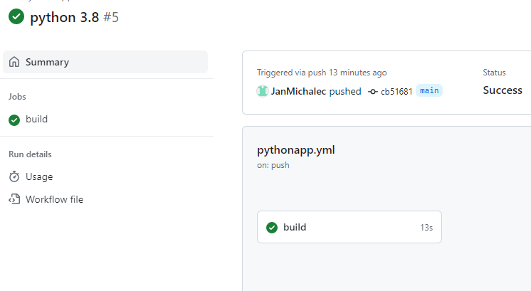

# to be moved

## Activate virtual env
```
python3 -m venv ~/.udacity-project
source ~/.udacity-project/bin/activate
```

## Install requirements, run lint and tests
```
make all
```

## Create ssh key
```
ssh-keygen -t rsa
```
then see the key in

```
cat ~/.ssh/id_rsa.pub
```

## Configure Azure Pipelines in Azure

## create web app

```
az webapp up --name mywebapp233899 --resource-group Azuredevops --sku B1 --logs --runtime "PYTHON:3.9"

```


## ssh into agent
ssh devopsagent@20.56.218.80

Dont forget to create a environment for the environment name in azure pipeline
## Screenshots




[](https://github.com/JanMichalec/udacity-project/actions/workflows/pythonapp.yml)


[](https://dev.azure.com/odluser233899/udacity-project/_build/latest?definitionId=1&branchName=main)


# Overview

<TODO: complete this with an overview of your project>

## Project Plan
<TODO: Project Plan

* A link to a Trello board for the project
* A link to a spreadsheet that includes the original and final project plan>

## Instructions

<TODO:  
* Architectural Diagram (Shows how key parts of the system work)>

<TODO:  Instructions for running the Python project.  How could a user with no context run this project without asking you for any help.  Include screenshots with explicit steps to create that work. Be sure to at least include the following screenshots:

* Project running on Azure App Service

* Project cloned into Azure Cloud Shell

* Passing tests that are displayed after running the `make all` command from the `Makefile`

* Output of a test run

* Successful deploy of the project in Azure Pipelines.  [Note the official documentation should be referred to and double checked as you setup CI/CD](https://docs.microsoft.com/en-us/azure/devops/pipelines/ecosystems/python-webapp?view=azure-devops).

* Running Azure App Service from Azure Pipelines automatic deployment

* Successful prediction from deployed flask app in Azure Cloud Shell.  [Use this file as a template for the deployed prediction](https://github.com/udacity/nd082-Azure-Cloud-DevOps-Starter-Code/blob/master/C2-AgileDevelopmentwithAzure/project/starter_files/flask-sklearn/make_predict_azure_app.sh).
The output should look similar to this:

```bash
udacity@Azure:~$ ./make_predict_azure_app.sh
Port: 443
{"prediction":[20.35373177134412]}
```

* Output of streamed log files from deployed application

> 

## Enhancements

<TODO: A short description of how to improve the project in the future>

## Demo 

<TODO: Add link Screencast on YouTube>


