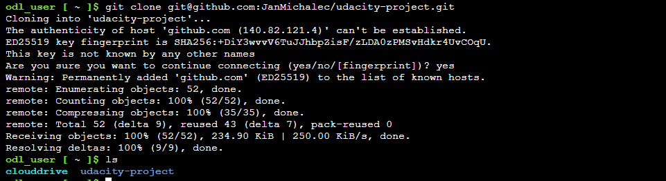
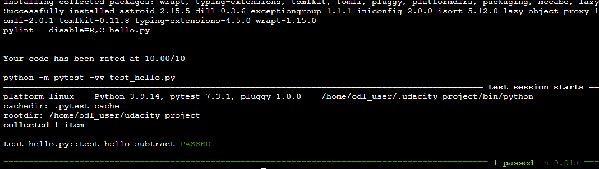
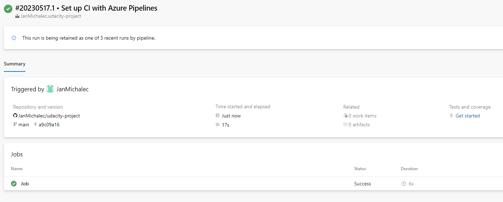
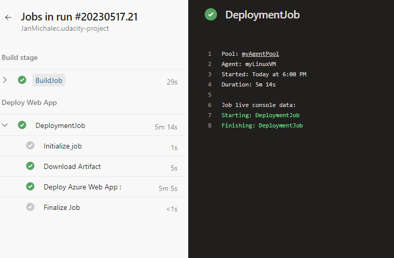
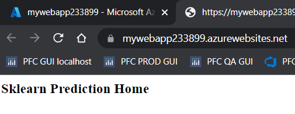
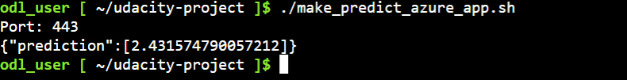
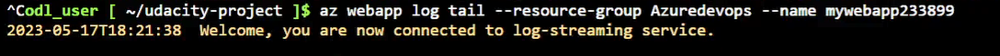
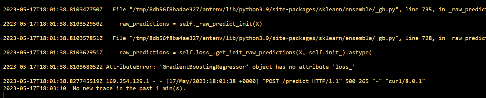

# Overview and demo

This project aims to demonstrate continuous delivery for a machine learning application. The Python based predictive model has been trained to predict housing prices. Below you will find a short demo of the application. 

https://github.com/JanMichalec/udacity-project/assets/48119545/52344228-f2a1-45e9-816a-3e99b7a82cd5

# Project Plan

* [Trello board](https://trello.com/invite/b/Po40Og78/ATTI5db0c6ad4f07b3ab46a59b2baa0fb27bE81E29DD/udacity-project)
* [Spreadheet](https://docs.google.com/spreadsheets/d/13SiJp5JTC88B4_A9zdNB-uO08Z41nOn_PK7vmmG2_Dw/edit?usp=sharing)

# Instructions

Descriptive diagram


## CI in the Github repository

For cloning the repository firstly generate ssh key
```
ssh-keygen -t rsa
```
then see the key in

```
cat ~/.ssh/id_rsa.pub
```
Example of succesfull cloning:




Activate virtual environment, install requirements and run tests
```
python3 -m venv ~/.udacity-project
source ~/.udacity-project/bin/activate
make all
```
Unit tests should pass




## CD on Azure

Create an Azure Web App by running  `commands.sh`. _Note: you may need to make the script executable by running `chmod +x`._

Create Azure Service Principal and Azure Pipeline Agent (you will need PAT). 

Create CD pipeline.



Make sure that both build and deploy stages are passing.



## Test Flask app

App is running now on `https://mywebapp233899.azurewebsites.net`.



Run `make_predict_azure_app.sh` to get predictions.



In case something does not work, inspect logs by `az webapp log tail`.




## Enhancements

In future it would be handy to write an user friendly interface (UI) for the ML app with simple online documentation about usage and idea behind the predictive model.


[](https://github.com/JanMichalec/udacity-project/actions/workflows/pythonapp.yml)
